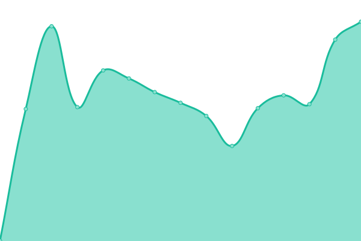
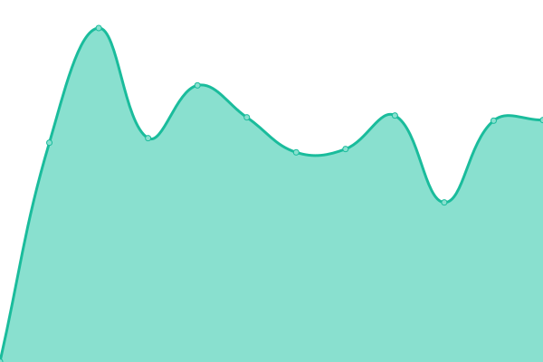
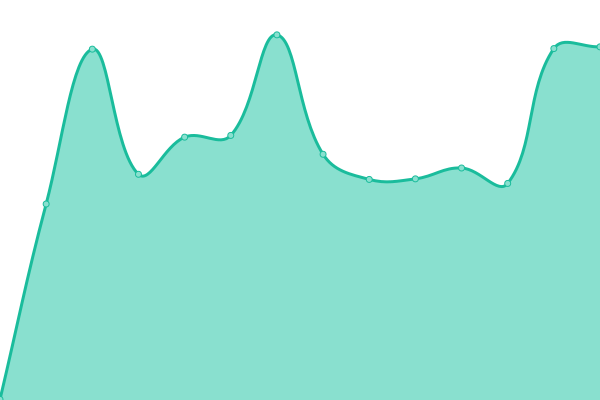
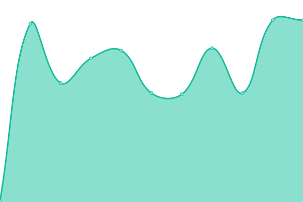

# [📈 Live Status](https://status.isekaimaid.xyz): <!--live status--> **🟩 All systems operational**

This repository contains the open-source uptime monitor and status page for [TriForMine](https://www.isekaimaid.xyz/), powered by [Upptime](https://github.com/upptime/upptime).

With [Upptime](https://upptime.js.org), you can get your own unlimited and free uptime monitor and status page, powered entirely by a GitHub repository. We use [Issues](https://github.com/TriForMine/isekaimaid-uptime/issues) as incident reports, [Actions](https://github.com/TriForMine/isekaimaid-uptime/actions) as uptime monitors, and [Pages](https://status.isekaimaid.xyz) for the status page.

<!--start: status pages-->
<!-- This summary is generated by Upptime (https://github.com/upptime/upptime) -->
<!-- Do not edit this manually, your changes will be overwritten -->
<!-- prettier-ignore -->
| URL | Status | History | Response Time | Uptime |
| --- | ------ | ------- | ------------- | ------ |
|  [Isekai Maid](https://www.isekaimaid.xyz) | 🟩 Up | [isekai-maid.yml](https://github.com/TriForMine/isekaimaid-uptime/commits/HEAD/history/isekai-maid.yml) | 

 543ms
     
 | 

<a href="https://status.isekaimaid.xyz/history/isekai-maid">99.78%</a>
    

|  [Isekai Maid Wiki](https://wiki.isekaimaid.xyz) | 🟩 Up | [isekai-maid-wiki.yml](https://github.com/TriForMine/isekaimaid-uptime/commits/HEAD/history/isekai-maid-wiki.yml) | 

 815ms
     
 | 

<a href="https://status.isekaimaid.xyz/history/isekai-maid-wiki">100.00%</a>
    

|  [Isekai Maid Roadmap](https://board.isekaimaid.xyz) | 🟩 Up | [isekai-maid-roadmap.yml](https://github.com/TriForMine/isekaimaid-uptime/commits/HEAD/history/isekai-maid-roadmap.yml) | 

 457ms
     
 | 

<a href="https://status.isekaimaid.xyz/history/isekai-maid-roadmap">100.00%</a>
    

|  [Isekai Maid Bot](server.isekaimaid.xyz) | 🟩 Up | [isekai-maid-bot.yml](https://github.com/TriForMine/isekaimaid-uptime/commits/HEAD/history/isekai-maid-bot.yml) | 

 120ms
     
 | 

<a href="https://status.isekaimaid.xyz/history/isekai-maid-bot">100.00%</a>
    

<!--end: status pages-->

[**Visit our status website →**](https://status.isekaimaid.xyz)

## 📄 License

- Powered by: [Upptime](https://github.com/upptime/upptime)
- Code: [MIT](./LICENSE) © [TriForMine](https://www.isekaimaid.xyz/)
- Data in the `./history` directory: [Open Database License](https://opendatacommons.org/licenses/odbl/1-0/)
